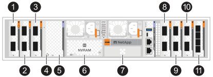
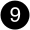
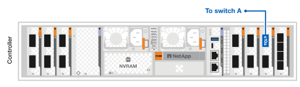

= Conecte os cabos de hardware para o seu sistema de storage AFX 2K
:allow-uri-read: 
:icons: font
:imagesdir: ../media/

[role="lead"]
Após instalar o hardware do rack para o seu sistema de storage AFX 2K, instale os cabos de rede para os controladores e conecte os cabos entre os controladores e os shelves de storage.

.Antes de começar
Entre em contato com o administrador da rede para obter informações sobre como conectar o sistema de armazenamento aos switches da rede.

.Sobre esta tarefa
* Esses procedimentos mostram configurações comuns.  O cabeamento específico depende dos componentes encomendados para seu sistema de armazenamento.  Para obter detalhes abrangentes de configuração e prioridades de slot, consultelink:https://hwu.netapp.com["Hardware Universe da NetApp"^] .
* Os slots de E/S em um controlador AFX 2K são numerados de 1 a 11.
+

+
[cols="10%,23%,10%,24%,10%,23%"]
|===
| Número do slot | Slot de E/S | Número do slot | Slot de E/S | Número do slot | Slot de E/S 

 a| 
image::../media/icon_round_1.svg[Chamada número 1]
| HA  a| 

image::../media/icon_round_5.svg[Chamada número 5]
| NVRAM12  a| 

| Rede 

 a| 
image::../media/icon_round_2.svg[Chamada número 2]
| Conjunto  a| 
image::../media/icon_round_6.svg[Chamada número 6]

image::../media/icon_round_7.svg[Chamada número 7]
| NVRAM12-EX  a| 
image::../media/icon_round_10.svg[Chamada número 10]
| Storage 

 a| 
image::../media/icon_round_3.svg[Chamada número 3]
| Rede  a| 
image::../media/icon_round_8.svg[Chamada número 8]
| Storage  a| 
image::../media/icon_round_11.svg[Chamada número 11]
| (*Opcional*) SFP28 de 25GbE com quatro portas para conectividade de gerenciamento adicional 
|===
* Os gráficos de cabeamento mostram ícones de seta indicando a orientação correta (para cima ou para baixo) da aba de puxar do conector do cabo ao inserir um conector em uma porta.
+
Ao inserir o conector, você deve sentir um clique; se não ouvir um clique, remova-o, vire-o e tente novamente.

+
image:../media/drw_cable_pull_tab_direction_ieops-1699.svg["Direção da aba de puxar o cabo"]

+
[NOTE]
====
Os componentes do conector são delicados e é preciso ter cuidado ao encaixá-los no lugar.

====
* Ao conectar um cabo a uma conexão de fibra óptica, insira o transceptor óptico na porta do controlador antes de conectar o cabo à porta do switch.
* O sistema de storage AFX 2K utiliza cabos 400GbE. As conexões 400GbE são feitas entre os controladores e os switches. As conexões entre os gabinetes de armazenamento e os switches utilizam cabos breakout 4x100GbE, com as conexões de 100GbE feitas nas portas dos gabinetes de unidades.
+
As conexões de armazenamento em prateleira podem ser feitas em qualquer porta breakout de 100GbE no switch. As conexões HA/Cluster podem ser feitas em qualquer porta de 400GbE no switch. Todas as portas do controlador "a" se conectam ao switch A e todas as portas do controlador "b" se conectam ao switch B.

* O uso misto de conexões breakout de cobre e ópticas (cabos) não é suportado pelos adaptadores de NIC NVIDIA C6X-DX e CX7 (100GbE). Você deve usar exclusivamente conexões de cobre ou ópticas e evitar combinar diferentes tipos de conexão. A mistura de tipos pode levar à saturação do link após uso prolongado.
+
Certifique-se de ter os cabos corretos para o seu tipo de conexão antes de conectar os switches.

+

NOTE: Para obter mais informações sobre como combinar tipos de conexão, consulte o artigo da Knowledge Base da NetApp link:https://kb.netapp.com/on-prem/ontap/OHW/OHW-Issues/CHW-3504["Erros de link CRC detectados na placa de rede CX6-DX com cabos breakout mistos de cobre e fibra nas portas"^].

[[step-1-connect-the-controllers-to-the-management-network]]
== Etapa 1: Conecte os controladores à rede de gerenciamento

Conecte a porta de gerenciamento (chave inglesa) em cada controlador a um dos switches de gerenciamento ou conecte-os diretamente à sua rede de gerenciamento.

Use os cabos 1000BASE-T RJ-45 para conectar as portas de gerenciamento (chave inglesa) em cada controlador aos switches de rede de gerenciamento.

image::../media/oie_cable_rj45.png[Cabos RJ-45]

*Cabos RJ-45 1000BASE-T*

image::../media/drw_afx_2k_management_connection_ieops-2863.svg[Conecte-se à sua rede de gerenciamento]

IMPORTANT: Não conecte os cabos de alimentação ainda.

.Passos
. Conecte-se à rede de gerenciamento.

[[step-2-connect-the-controllers-to-the-host-network]]
== Etapa 2: Conecte os controladores à rede host

Conecte as portas do módulo Ethernet à sua rede host.

Este procedimento pode ser diferente dependendo da configuração do seu módulo de E/S.  A seguir estão alguns exemplos típicos de cabeamento de rede host.  Verlink:https://hwu.netapp.com["Hardware Universe da NetApp"^] para a configuração específica do seu sistema.

.Passos
. Conecte as seguintes portas ao seu switch de rede de dados Ethernet A.
+
** Controlador
+
*** e3a
*** e9a
+
*Cabos 400GbE*

+
image::../media/oie_cable100_gbe_qsfp28.png[Cabo Ethernet de 400 Gb]

+
image::../media/drw_afx_2k_host_switch_a_ieops-2864.svg[Cabo para rede Ethernet]

. Conecte as seguintes portas ao seu switch de rede de dados Ethernet B.
+
** Controlador
+
*** e3b
*** e9b
+
*Cabos 400GbE*

+
image::../media/oie_cable100_gbe_qsfp28.png[Cabo Ethernet de 400 Gb]

+
image::../media/drw_afx_2k_host_switch_b_ieops-2865.svg[Cabo para rede Ethernet]

[[step-3-cable-the-cluster-and-ha-connections]]
== Etapa 3: Conecte os cabos do cluster e das conexões de alta disponibilidade (HA)

Utilize o cabo de interconexão Cluster e o cabo de interconexão HA para conectar as portas e1a e e2a ao switch A e as portas e1b e e2b ao switch B. As portas e1a/e1b são utilizadas para as conexões HA e as portas e2a/e2b são utilizadas para as conexões de cluster.

.Passos
. Conecte as seguintes portas do controlador a qualquer porta que não seja ISL no switch de rede do cluster A.
+
** Controlador
+
*** e1a (HA)
*** e2a (Cluster)
+
*Cabos 400GbE*

+
image::../media/oie_cable_25Gb_Ethernet_SFP28_ieops-1069.png[Cabo HA de cluster]

+
image::../media/drw_afx_2k_cluster_switch_a_ieops-2866.svg[Conexões de cabos de cluster para rede de cluster]

. Conecte as seguintes portas do controlador a qualquer porta que não seja ISL no switch de rede do cluster B.
+
** Controlador
+
*** e1b (HA)
*** e2b (Cluster)
+
*Cabos 400GbE*

+
image::../media/oie_cable_25Gb_Ethernet_SFP28_ieops-1069.png[Cabo HA de cluster]

+
image::../media/drw_afx_2k_cluster_switch_b_ieops-2867.svg[Conexões de cabos de cluster para rede de cluster]

[[step-4-cable-the-controller-to-switch-storage-connections]]
== Etapa 4: Conecte os cabos do controlador ao switch de armazenamento

Conecte as portas de storage do controlador aos switches. Certifique-se de que você possui os cabos e conectores corretos para seus switches. Consulte  https://hwu.netapp.com["Hardware Universe"^] para mais informações.

NOTE: As portas e10b e e8a nos controladores não são utilizadas para conexões de armazenamento na configuração do sistema de storage AFX 2K.

.Passos
. Conecte as seguintes portas de armazenamento a qualquer porta que não seja ISL no switch A.
+
** Controlador
+
*** e10a
+
*Cabos 400GbE*

+
image::../media/oie_cable100_gbe_qsfp28.png[Cabo de 100 Gb]

+

. Conecte as seguintes portas de armazenamento a qualquer porta que não seja ISL no switch B.
+
** Controlador
+
*** e8b
+
*Cabos 400GbE*

+
image::../media/oie_cable100_gbe_qsfp28.png[Cabo de 100 Gb]

+
image::../media/drw_afx_2k_storage_connection_b_ieops-2870.svg[Conecte o controlador de storage ao switch B]

[[step-5-cable-the-shelf-to-switch-connections]]
== Etapa 5: Conecte os cabos da prateleira ao switch

Conecte os gabinetes de armazenamento NX224 às portas de breakout 100GbE nos switches.

Para o número máximo de prateleiras suportadas pelo seu sistema de armazenamento e para todas as suas opções de cabeamento, consultelink:https://hwu.netapp.com["Hardware Universe da NetApp"^] .

.Passos
. Conecte as seguintes portas do shelf a qualquer porta de breakout no switch A e no switch B para o módulo A.
+
** Módulo A para alternar as conexões A
+
*** e1a
*** e2a
*** e3a
*** e4a

** Módulo A para conexões do switch B
+
*** e1b
*** e2b
*** e3b
*** e4b
+
*Cabos 100GbE*

+
image::../media/oie_cable100_gbe_qsfp28.png[Cabo de 100 Gb]

+
image::../media/drw_afx_shelf_cabling_a_ieops-2356.svg[Prateleira de cabos para interruptor A e interruptor B]

. Conecte as seguintes portas de prateleira a qualquer porta de breakout no switch A e no switch B para o módulo B.
+
** Módulo B para conexões do switch A
+
*** e1a
*** e2a
*** e3a
*** e4a

** Módulo B para alternar conexões B
+
*** e1b
*** e2b
*** e3b
*** e4b
+
*Cabos 100GbE*

+
image::../media/oie_cable100_gbe_qsfp28.png[Cabo de 100 Gb]

+
image::../media/drw_afx_shelf_cabling_b_ieops-2357.svg[Prateleira de cabos para interruptor A e interruptor B]

.O que vem a seguir?
Após a instalação dos cabos do hardware,link:power-on-configure-switch.html["ligar e configurar os interruptores"] .
