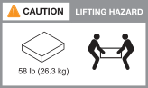

= Requisitos de instalação para sistemas de storage AFX 2K
:allow-uri-read: 
:icons: font
:imagesdir: ../media/

[role="lead"]
Verifique o equipamento necessário e as precauções de elevação para seu controlador de armazenamento AFX 2K e prateleiras de armazenamento.

[[equipment-needed-for-install]]
== Equipamento necessário para instalação

Para instalar seu sistema de storage AFX 2K, você precisará dos seguintes equipamentos e ferramentas.

* Acesso a um navegador da Web para configurar seu sistema de armazenamento
* Cinta de descarga eletrostática (ESD)
* Lanterna
* Laptop ou console com conexão USB/serial
* Clipe de papel ou caneta esferográfica de ponta fina para definir IDs de prateleiras de armazenamento
* Chave de fenda Phillips nº 2

[[lifting-precautions]]
== Precauções de elevação

O controlador de armazenamento AFX e as prateleiras de armazenamento são pesados.  Tenha cuidado ao levantar e mover esses itens.

[[storage-controller-weights]]
=== Pesos do controlador de armazenamento

Tome as precauções necessárias ao mover ou levantar seu controlador de armazenamento AFX 2K.

Um controlador de armazenamento AFX 2K pode pesar até 64,0 lb (29,03 kg). Para levantar o controlador de armazenamento, use duas pessoas ou um elevador hidráulico.

.Precaução ao levantar o controlador AFX 2K.

[[storage-shelf-weights]]
=== Pesos de prateleiras de armazenamento

Tome as precauções necessárias ao mover ou levantar sua prateleira.

.Prateleira NX224
Uma prateleira NX224 pode pesar até 60,1 lb (27,3 kg). Para levantar a prateleira, use duas pessoas ou um elevador hidráulico. Mantenha todos os componentes na prateleira (tanto na parte frontal quanto na traseira) para evitar o desbalanceamento do peso da prateleira.

.Precaução ao levantar a prateleira NX224.

[[switch-weights]]
=== Pesos do switch

Tome as precauções necessárias ao mover ou levantar o switch de rede.

.Cisco Nexus 9808
Um Cisco 9808 sem carga pode pesar até link:https://www.cisco.com/c/en/us/products/collateral/switches/nexus-9000-series-switches/nexus9800-series-switches-ds.html#Productspecifications["162 lb (73 kg) e um switch Cisco 9808 totalmente carregado pode chegar a 766 lb (347 kg)"^]. Para levantar o switch, use um elevador hidráulico.

.Precaução ao levantar um Cisco Nexus 9808 descarregado.
image::../media/drw_afx_2k_weight_icon_ieops-2939.svg[Ícone de alerta de levantamento do Cisco Nexus 9808]

.Precaução ao levantar um Cisco Nexus 9808 totalmente carregado.
image::../media/drw_afx_2k_nexus9808_loaded_weight_caution_ieops-2940.svg[Cisco Nexus 9808 totalmente carregado ícone de aviso de levantamento]

.Cisco Nexus9332D-GX2B
Um Cisco 9332D-GX2B pode pesar até link:https://www.cisco.com/c/en/us/td/docs/dcn/hw/aci/nexus9000/9332d-gx2b/cisco-nexus-9332d-gx2b-aci-mode-switch-hardware-installation-guide/m_n93xxx_system_specs.html["12,7 kg (28,1 lb)"^].

.Cisco Nexus 9364D-GX2A
Um switch Cisco Nexus 9364D-GX2A pode pesar até link:https://www.cisco.com/c/en/us/td/docs/dcn/hw/nx-os/nexus9000/9364d-gx2a/cisco-nexus-9364d-gx2a-nx-os-mode-switch-hardware-installation-guide/m_n93xxx_system_specs.html["58 lb (26,3 kg)"^]. Para levantar o switch, use duas pessoas ou um elevador hidráulico.

.Precaução de levantamento do Cisco Nexus 9364D-GX2A.

.Informações relacionadas
* https://library.netapp.com/ecm/ecm_download_file/ECMP12475945["Informações de segurança e avisos regulatórios"^]

.O que vem a seguir?
Depois de analisar os requisitos de hardware, você link:prepare-hardware.html["Prepare-se para instalar seu sistema de storage AFX 2K"].
