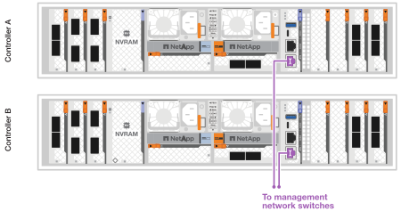
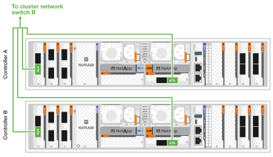
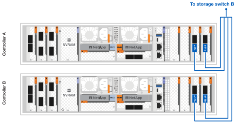

= Cabeamento do hardware para seu sistema de armazenamento AFX 1K
:allow-uri-read: 
:icons: font
:imagesdir: ../media/

[role="lead"]
Depois de instalar o hardware do rack para seu sistema de armazenamento AFX 1K, instale os cabos de rede para os controladores e conecte os cabos entre os controladores e as prateleiras de armazenamento.

.Antes de começar
Entre em contato com o administrador da rede para obter informações sobre como conectar o sistema de armazenamento aos switches da rede.

.Sobre esta tarefa
* Esses procedimentos mostram configurações comuns.  O cabeamento específico depende dos componentes encomendados para seu sistema de armazenamento.  Para obter detalhes abrangentes de configuração e prioridades de slot, consultelink:https://hwu.netapp.com["Hardware Universe da NetApp"^] .
* Os slots de E/S em um controlador AFX são numerados de 1 a 11.
+
image::../media/drw_a1K_back_slots_labeled_ieops-2162.svg[Numeração de slots em um controlador AFX]

* Os gráficos de cabeamento mostram ícones de seta indicando a orientação correta (para cima ou para baixo) da aba de puxar do conector do cabo ao inserir um conector em uma porta.
+
Ao inserir o conector, você deve sentir um clique; se não ouvir um clique, remova-o, vire-o e tente novamente.

+
image:../media/drw_cable_pull_tab_direction_ieops-1699.svg["Direção da aba de puxar o cabo"]

+
[NOTE]
====
Os componentes do conector são delicados e é preciso ter cuidado ao encaixá-los no lugar.

====
* Ao conectar um cabo a uma conexão de fibra óptica, insira o transceptor óptico na porta do controlador antes de conectar o cabo à porta do switch.
* O sistema de armazenamento AFX 1K utiliza 4 cabos breakout de 100 GbE no cluster e na rede de armazenamento.  As conexões de 400 GbE são feitas nas portas do switch, e as conexões de 100 GbE são feitas nas portas do controlador e da prateleira da unidade.  Conexões de armazenamento e HA/Cluster podem ser feitas em qualquer porta não ISL no switch.
+
Para uma determinada conexão de cabo breakout 4x100GbE a uma porta específica do switch, você conecta todas as quatro portas de um determinado controlador ao switch através deste único cabo breakout.

+
** 1 porta HA (slot 1)
** 1 porta de cluster (slot 7)
** 2 portas de armazenamento (slots 10, 11)
+
Todas as portas "a" se conectam ao switch A, e todas as portas "b" se conectam ao switch B.

NOTE: As configurações de switch Cisco Nexus 9332D-GX2B e 9364D-GX2A para o sistema de armazenamento AFX 1K exigem 4 conexões de cabo breakout de 100 GbE.

== Etapa 1: Conecte os controladores à rede de gerenciamento

Conecte a porta de gerenciamento em cada switch a qualquer um dos switches de gerenciamento (se solicitado) ou conecte-os diretamente à sua rede de gerenciamento.

A porta de gerenciamento é a porta superior direita localizada no lado da PSU do switch.  O cabo CAT6 para cada switch precisa ser roteado através do painel de passagem depois que os switches forem instalados para se conectar aos switches de gerenciamento ou à rede de gerenciamento.

Use os cabos 1000BASE-T RJ-45 para conectar as portas de gerenciamento (chave inglesa) em cada controlador aos switches de rede de gerenciamento.

image::../media/oie_cable_rj45.png[Cabos RJ-45]

*Cabos RJ-45 1000BASE-T*

IMPORTANT: Não conecte os cabos de alimentação ainda.

. Conecte-se à rede do host.

== Etapa 2: Conecte os controladores à rede host

Conecte as portas do módulo Ethernet à sua rede host.

Este procedimento pode ser diferente dependendo da configuração do seu módulo de E/S.  A seguir estão alguns exemplos típicos de cabeamento de rede host.  Verlink:https://hwu.netapp.com["Hardware Universe da NetApp"^] para a configuração específica do seu sistema.

.Passos
. Conecte as seguintes portas ao seu switch de rede de dados Ethernet A.
+
** Controlador A (Exemplo)
+
*** e2a
*** e3a

** Controlador B (Exemplo)
+
*** e2a
*** e3a
+
*Cabos 100GbE*

+
image::../media/oie_cable100_gbe_qsfp28.png[Cabo Ethernet de 100 Gb]

+
image::../media/drw_afx_network_cabling_a_ieops-2350.svg[Cabo para rede Ethernet]

. Conecte as seguintes portas ao seu switch de rede de dados Ethernet B.
+
** Controlador A (Exemplo)
+
*** e2b
*** e3b

** Controlador B (Exemplo)
+
*** e2b
*** e3b
+
*Cabos 100GbE*

+
image::../media/oie_cable100_gbe_qsfp28.png[Cabo Ethernet de 100 Gb]

+
image::../media/drw_afx_network_cabling_b_ieops-2351.svg[Cabo para rede Ethernet]

== Etapa 3: Conecte os cabos do cluster e das conexões de HA

Use o cabo de interconexão de cluster e HA para conectar as portas e1a e e7a ao switch A e e1b e e7b ao switch B. As portas e1a/e1b são usadas para as conexões de HA, e as portas e7a/e7b são usadas para as conexões de cluster.

.Passos
. Conecte as seguintes portas do controlador a qualquer porta não ISL no switch de rede do cluster A.
+
** Controlador A
+
*** e1a (HA)
*** e7a (Cluster)

** Controlador B
+
*** e1a (HA)
*** e7a (Cluster)
+
*Cabos 100GbE*

+
image::../media/oie_cable_25Gb_Ethernet_SFP28_ieops-1069.png[Cabo HA de cluster]

+
image::../media/drw_afx_switched_cluster_cabling_a_ieops-2352.svg[Conexões de cluster de cabos à rede de cluster]

. Conecte as seguintes portas do controlador a qualquer porta não ISL no switch de rede do cluster B.
+
** Controlador A
+
*** e1b (HA)
*** e7b (Cluster)

** Controlador B
+
*** e1b (HA)
*** e7b (Cluster)
+
*Cabos 100GbE*

+
image::../media/oie_cable_25Gb_Ethernet_SFP28_ieops-1069.png[Cabo HA de cluster]

+

== Etapa 4: Conecte os cabos das conexões de armazenamento do controlador ao switch

Conecte as portas de armazenamento do controlador aos switches.  Certifique-se de ter os cabos e conectores corretos para seus switches. Ver https://hwu.netapp.com["Hardware Universe"^] para maiores informações.

. Conecte as seguintes portas de armazenamento a qualquer porta não ISL no switch A.
+
** Controlador A
+
*** e10a
*** e11a

** Controlador B
+
*** e10a
*** e11a
+
*Cabos 100GbE*

+
image::../media/oie_cable100_gbe_qsfp28.png[Cabo de 100 Gb]

+
image::../media/drw_afx_controller_storage_cable_a_ieops-2354.svg[Armazenamento do controlador de cabo para alternar A]

. Conecte as seguintes portas de armazenamento a qualquer porta não ISL no switch B.
+
** Controlador A
+
*** e10b
*** e11b

** Controlador B
+
*** e10b
*** e11b
+
*Cabos 100GbE*

+
image::../media/oie_cable100_gbe_qsfp28.png[Cabo de 100 Gb]

+

== Etapa 5: Conecte os cabos da prateleira ao switch

Conecte as prateleiras de armazenamento NX224 aos switches.

Para o número máximo de prateleiras suportadas pelo seu sistema de armazenamento e para todas as suas opções de cabeamento, consultelink:https://hwu.netapp.com["Hardware Universe da NetApp"^] .

. Conecte as seguintes portas de prateleira a qualquer porta não ISL no switch A e no switch B para o módulo A.
+
** Módulo A para alternar as conexões A
+
*** e1a
*** e2a
*** e3a
*** e4a

** Módulo A para conexões do switch B
+
*** e1b
*** e2b
*** e3b
*** e4b
+
*Cabos 100GbE*

+
image::../media/oie_cable100_gbe_qsfp28.png[Cabo de 100 Gb]

+
image::../media/drw_afx_shelf_cabling_a_ieops-2356.svg[Prateleira de cabos para interruptor A e interruptor B]

. Conecte as seguintes portas de prateleira a qualquer porta não ISL no switch A e no switch B para o módulo B.
+
** Módulo B para conexões do switch A
+
*** e1a
*** e2a
*** e3a
*** e4a

** Módulo B para alternar conexões B
+
*** e1b
*** e2b
*** e3b
*** e4b
+
*Cabos 100GbE*

+
image::../media/oie_cable100_gbe_qsfp28.png[Cabo de 100 Gb]

+
image::../media/drw_afx_shelf_cabling_b_ieops-2357.svg[Prateleira de cabos para interruptor A e interruptor B]

.O que vem a seguir?
Após a instalação dos cabos do hardware,link:power-on-configure-switch.html["ligar e configurar os interruptores"] .
