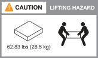

= Requisitos de instalação para sistemas de armazenamento AFX 1K
:allow-uri-read: 
:icons: font
:imagesdir: ../media/

[role="lead"]
Revise o equipamento necessário e as precauções de elevação para seu controlador de armazenamento AFX 1K e prateleiras de armazenamento.

== Equipamento necessário para instalação

Para instalar seu sistema de armazenamento AFX 1K, você precisa dos seguintes equipamentos e ferramentas.

* Acesso a um navegador da Web para configurar seu sistema de armazenamento
* Cinta de descarga eletrostática (ESD)
* Lanterna
* Laptop ou console com conexão USB/serial
* Clipe de papel ou caneta esferográfica de ponta fina para definir IDs de prateleiras de armazenamento
* Chave de fenda Phillips nº 2

== Precauções de elevação

O controlador de armazenamento AFX e as prateleiras de armazenamento são pesados.  Tenha cuidado ao levantar e mover esses itens.

=== Pesos do controlador de armazenamento

Tome as precauções necessárias ao mover ou levantar seu controlador de armazenamento AFX 1K.

Um controlador de armazenamento AFX 1K pode pesar até 62,83 lb (28,5 kg). Para levantar o controlador de armazenamento, use duas pessoas ou um elevador hidráulico.

.Precaução ao levantar o controlador AFX 1K.

=== Pesos de prateleiras de armazenamento

Tome as precauções necessárias ao mover ou levantar sua prateleira.

.Prateleira NX224
--
Uma prateleira NX224 pode pesar até 60,1 lb (27,3 kg). Para levantar a prateleira, use duas pessoas ou um elevador hidráulico. Mantenha todos os componentes na prateleira (tanto na parte frontal quanto na traseira) para evitar o desbalanceamento do peso da prateleira.

.Precaução ao levantar a prateleira NX224.
image::../media/drw_nx224_lifting_weight_ieops-2437.svg[Cuidado com o levantamento do NX224 NSM100]

.Informações relacionadas
* https://library.netapp.com/ecm/ecm_download_file/ECMP12475945["Informações de segurança e avisos regulatórios"^]

.O que vem a seguir?
Depois de revisar os requisitos de hardware, vocêlink:prepare-hardware.html["prepare-se para instalar seu sistema de armazenamento AFX 1K"] .

--