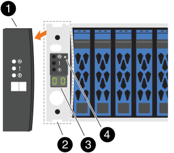
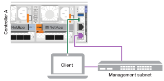
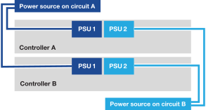

= Ligue seu sistema de armazenamento AFX 1K
:allow-uri-read: 
:icons: font
:imagesdir: ../media/

[role="lead"]
Depois de instalar o hardware do rack para seu sistema de armazenamento AFX 1K e instalar os cabos para os nós do controlador e prateleiras de armazenamento, você deve ligar as prateleiras de armazenamento e os nós do controlador.

[[step-1-power-on-the-shelf-and-assign-shelf-id]]
== Etapa 1: Ligue a prateleira e atribua o ID da prateleira

Cada prateleira tem um ID de prateleira exclusivo, garantindo sua distinção na configuração do seu sistema de armazenamento.

.Sobre esta tarefa
* Um ID de prateleira válido é de 01 a 99.
* Você deve desligar e ligar uma prateleira (desconecte os dois cabos de alimentação, aguarde no mínimo 10 segundos e conecte-os novamente) para que a ID da prateleira entre em vigor.

.Passos
. Ligue a prateleira conectando os cabos de alimentação primeiro à prateleira, prendendo-os no lugar com o retentor do cabo de alimentação e, em seguida, conectando os cabos de alimentação às fontes de alimentação em circuitos diferentes.
+
A prateleira liga e inicializa automaticamente quando conectada.

. Remova a tampa da extremidade esquerda para acessar o botão de identificação da prateleira atrás do painel frontal.
+

+
[cols="20%,80%"]
|===

 a| 
image::../media/icon_round_1.png[Chamada número 1]
 a| 
Tampa da extremidade da prateleira

 a| 
image::../media/icon_round_2.png[[Chamada número 2]
 a| 
Placa frontal da prateleira

 a| 
image::../media/icon_round_3.png[[Chamada número 3]
 a| 
Número de identificação da prateleira

 a| 
image::../media/icon_round_4.png[[Chamada número 4]
 a| 
Botão de identificação da prateleira

|===
. Alterar o primeiro número do ID da prateleira:
+
.. Insira a ponta esticada de um clipe de papel ou de uma caneta esferográfica de ponta fina no pequeno orifício para pressionar suavemente o botão de identificação da prateleira.
.. Pressione suavemente e segure o botão de ID da prateleira até que o primeiro número no visor digital pisque e, em seguida, solte o botão.
+
O número pisca em 15 segundos, ativando o modo de programação de ID da prateleira.

+

NOTE: Se o ID demorar mais de 15 segundos para piscar, pressione e segure o botão de ID da prateleira novamente, certificando-se de pressioná-lo completamente.

.. Pressione e solte o botão ID da prateleira para avançar o número até atingir o número desejado de 0 a 9.
+
Cada pressão e liberação podem durar apenas um segundo.

+
O primeiro número continua piscando.

. Alterar o segundo número do ID da prateleira:
+
.. Pressione e segure o botão até que o segundo número no visor digital pisque.
+
Pode levar até três segundos para o número piscar.

+
O primeiro número no visor digital para de piscar.

.. Pressione e solte o botão ID da prateleira para avançar o número até atingir o número desejado de 0 a 9.
+
O segundo número continua piscando.

. Bloqueie o número desejado e saia do modo de programação pressionando e segurando o botão ID da prateleira até que o segundo número pare de piscar.
+
Pode levar até três segundos para o número parar de piscar.

+
Ambos os números no visor digital começam a piscar e o LED âmbar acende após cerca de cinco segundos, alertando que o ID da prateleira pendente ainda não entrou em vigor.

. Desligue e ligue a prateleira por pelo menos 10 segundos para que a ID da prateleira entre em vigor.
+
.. Desconecte o cabo de alimentação de ambas as fontes de alimentação na prateleira.
.. Aguarde 10 segundos.
.. Conecte os cabos de alimentação novamente nas fontes de alimentação da prateleira para concluir o ciclo de energia.
+
A fonte de alimentação liga assim que você conecta o cabo de alimentação.  Seu LED bicolor deve acender em verde.

. Recoloque a tampa da extremidade esquerda.

[[step-2-power-on-the-controller-nodes]]
== Etapa 2: Ligue os nós do controlador

Depois de ligar suas prateleiras de armazenamento e atribuir IDs exclusivos a elas, ligue a energia dos nós do controlador de armazenamento.

.Passos
. Conecte seu laptop à porta serial do console.  Isso permite que você monitore a sequência de inicialização quando os controladores são ligados.
+
.. Defina a porta serial do console no laptop para 115.200 baud com N-8-1.
+
Consulte a ajuda on-line do seu laptop para obter instruções sobre como configurar a porta serial do console.

.. Conecte o cabo do console ao laptop e conecte a porta serial do console no controlador usando o cabo do console que veio com seu sistema de armazenamento.
.. Conecte o laptop ao switch na sub-rede de gerenciamento.
+

. Atribua um endereço TCP/IP ao laptop, usando um que esteja na sub-rede de gerenciamento.
. Conecte os cabos de alimentação nas fontes de alimentação do controlador e, em seguida, conecte-os às fontes de alimentação em circuitos diferentes.
+

+
** O sistema começa a inicializar.  A inicialização pode levar até oito minutos.
** Os LEDs piscam e os ventiladores ligam, indicando que os controladores estão ligando.
** Os ventiladores podem fazer barulho na inicialização, o que é normal.

. Prenda os cabos de alimentação usando o dispositivo de fixação em cada fonte de alimentação.

[[step-3-verify-the-switch-connections]]
== Passo 3: Verifique as conexões do switch

A partir da CLI do switch, verifique se as portas do switch conectadas às portas do cluster estão ativas, se os nós do cluster estão em suas VLANs corretas e se a conexão ISL entre os dois switches está funcional.

. Verifique se as portas do switch conectadas às portas do cluster estão ativas:
+
`show interface brief`

+
Você pode usar  `| grep up` para filtrar a saída e exibir apenas as portas que estão ativas.

+
.Mostrar exemplo para os switches Cisco Nexus 9332D-GX2B e 9364D-GX2A
[%collapsible]
====
[listing, subs="+quotes"]
----
cs1# *show interface brief | grep up*
.
.
Eth1/9/3        1       eth  trunk  up      none                     100G(D) --
Eth1/9/4        1       eth  trunk  up      none                     100G(D) --
Eth1/15/1       1       eth  trunk  up      none                     100G(D) --
Eth1/15/2       1       eth  trunk  up      none                     100G(D) --
Eth1/15/3       1       eth  trunk  up      none                     100G(D) --
Eth1/15/4       1       eth  trunk  up      none                     100G(D) --
Eth1/16/1       1       eth  trunk  up      none                     100G(D) --
Eth1/16/2       1       eth  trunk  up      none                     100G(D) --
Eth1/16/3       1       eth  trunk  up      none                     100G(D) --
Eth1/16/4       1       eth  trunk  up      none                     100G(D) --
Eth1/17/1       1       eth  trunk  up      none                     100G(D) --
Eth1/17/2       1       eth  trunk  up      none                     100G(D) --
Eth1/17/3       1       eth  trunk  up      none                     100G(D) --
Eth1/17/4       1       eth  trunk  up      none                     100G(D) --
.
.
----
====
. Verifique se os nós do cluster estão em suas VLANs corretas usando os seguintes comandos:
+
`show vlan brief`

+
`show interface trunk`

+
.Mostrar exemplo para switches Cisco Nexus 9332D-GX2B
[%collapsible]
====
[listing, subs="+quotes"]
----
cs1# *show vlan brief*
VLAN Name                             Status    Ports
---- -------------------------------- --------- -------------------------------
1    default                          active    Po1, Po999, Eth1/31, Eth1/32
                                                Eth1/33, Eth1/34, Eth1/1/1
                                                Eth1/1/2, Eth1/1/3, Eth1/1/4
.
.
.
                                                Eth1/29/4, Eth1/30/1, Eth1/30/2
                                                Eth1/30/3, Eth1/30/4
17   VLAN0017                         active    Eth1/1/1, Eth1/1/2, Eth1/1/3
                                                Eth1/1/4, Eth1/2/1, Eth1/2/2
.
.
.
                                                Eth1/29/3, Eth1/29/4, Eth1/30/1
                                                Eth1/30/2, Eth1/30/3, Eth1/30/4
18   VLAN0018                         active    Eth1/1/1, Eth1/1/2, Eth1/1/3
                                                Eth1/1/4, Eth1/2/1, Eth1/2/2
.
.
.
                                                Eth1/29/3, Eth1/29/4, Eth1/30/1
                                                Eth1/30/2, Eth1/30/3, Eth1/30/4
30   VLAN0030                         active    Eth1/1/1, Eth1/1/2, Eth1/1/3
                                                Eth1/1/4, Eth1/2/1, Eth1/2/2
.
.
.
                                                Eth1/29/3, Eth1/29/4, Eth1/30/1
                                                Eth1/30/2, Eth1/30/3, Eth1/30/4
40   VLAN0040                         active    Eth1/1/1, Eth1/1/2, Eth1/1/3
                                                Eth1/1/4, Eth1/2/1, Eth1/2/2
.
.
.
                                                Eth1/29/3, Eth1/29/4, Eth1/30/1
                                                Eth1/30/2, Eth1/30/3, Eth1/30/4

cs1# *show interface trunk*
--------------------------------------------------------------------------------
Port          Native  Status        Port
              Vlan                  Channel
--------------------------------------------------------------------------------
Eth1/1/1      1       trunking      --
Eth1/1/2      1       trunking      --
Eth1/1/3      1       trunking      --
Eth1/1/4      1       trunking      --
Eth1/2/1      1       trunking      --
Eth1/2/2      1       trunking      --
Eth1/2/3      1       trunking      --
Eth1/2/4      1       trunking      --
.
.
.
Eth1/30/1     none
Eth1/30/2     none
Eth1/30/3     none
Eth1/30/4     none
Eth1/31       none
Eth1/32       none
Po1           1
----
====
+
.Mostrar exemplo para switches Cisco Nexus 9364D-GX2A
[%collapsible]
====
[listing, subs="+quotes"]
----
cs1# *show vlan brief*

VLAN Name                             Status    Ports
---- -------------------------------- --------- -------------------------------
1    default                          active    Po1, Po999, Eth1/63, Eth1/64
                                                Eth1/65, Eth1/66, Eth1/1/1
                                                Eth1/1/2, Eth1/1/3, Eth1/1/4
.
.
.
                                                Eth1/62/1, Eth1/62/2, Eth1/62/3
                                                Eth1/62/4
17   VLAN0017                         active    Eth1/1/1, Eth1/1/2, Eth1/1/3
                                                Eth1/1/4, Eth1/2/1, Eth1/2/2
.
.
.
                                                Eth1/61/4, Eth1/62/1, Eth1/62/2
                                                Eth1/62/3, Eth1/62/4
18   VLAN0018                         active    Eth1/1/1, Eth1/1/2, Eth1/1/3
                                                Eth1/1/4, Eth1/2/1, Eth1/2/2
.
.
.
                                                Eth1/61/4, Eth1/62/1, Eth1/62/2
                                                Eth1/62/3, Eth1/62/4
30   VLAN0030                         active    Eth1/1/1, Eth1/1/2, Eth1/1/3
                                                Eth1/1/4, Eth1/2/1, Eth1/2/2
.
.
.
                                                Eth1/61/4, Eth1/62/1, Eth1/62/2
                                                Eth1/62/3, Eth1/62/4
40   VLAN0040                         active    Eth1/1/1, Eth1/1/2, Eth1/1/3
                                                Eth1/1/4, Eth1/2/1, Eth1/2/2
.
.
.
                                                Eth1/61/4, Eth1/62/1, Eth1/62/2
                                                Eth1/62/3, Eth1/62/4

cs1# *show interface trunk*

-----------------------------------------------------
Port          Native  Status        Port
              Vlan                  Channel
-----------------------------------------------------
Eth1/1/1      1       trunking      --
Eth1/1/2      1       trunking      --
Eth1/1/3      1       trunking      --
Eth1/1/4      1       trunking      --
Eth1/2/1      1       trunking      --
Eth1/2/2      1       trunking      --
Eth1/2/3      1       trunking      --
Eth1/2/4      1       trunking      --
.
.
.
Eth1/62/2     none
Eth1/62/3     none
Eth1/62/4     none
Eth1/63       none
Eth1/64       none
Po1           1
----
====
+

NOTE: Para obter detalhes específicos sobre o uso de portas e VLANs, consulte a seção de banner e notas importantes no seu RCF.

. Verifique se o ISL entre o primeiro switch (cs1) e o segundo switch (cs2) está funcionando:
+
`show port-channel summary`

+
.Mostrar exemplo para switches Cisco Nexus 9332D-GX2B
[%collapsible]
====
[listing, subs="+quotes"]
----
cs1# *show port-channel summary*
Flags:  D - Down        P - Up in port-channel (members)
        I - Individual  H - Hot-standby (LACP only)
        s - Suspended   r - Module-removed
        b - BFD Session Wait
        S - Switched    R - Routed
        U - Up (port-channel)
        p - Up in delay-lacp mode (member)
        M - Not in use. Min-links not met
--------------------------------------------------------------------------------
Group Port-       Type     Protocol  Member Ports
      Channel
--------------------------------------------------------------------------------
1     Po1(SU)     Eth      LACP      Eth1/31(P)   Eth1/32(P)
999   Po999(SD)   Eth      NONE      --
cs1#
----
====
+
.Mostrar exemplo para switches Cisco Nexus 9364D-GX2A
[%collapsible]
====
[listing, subs="+quotes"]
----
cs1# *show port-channel summary*
Flags:  D - Down        P - Up in port-channel (members)
        I - Individual  H - Hot-standby (LACP only)
        s - Suspended   r - Module-removed
        b - BFD Session Wait
        S - Switched    R - Routed
        U - Up (port-channel)
        p - Up in delay-lacp mode (member)
        M - Not in use. Min-links not met
--------------------------------------------------------------------------------
Group Port-       Type     Protocol  Member Ports
      Channel
--------------------------------------------------------------------------------
1     Po1(SU)     Eth      LACP      Eth1/63(P)   Eth1/64(P)
999   Po999(SD)   Eth      NONE      --
cs1#
----
====

.O que vem a seguir?
Após ligar o seu sistema de storage AFX 1K, link:../install-setup/cluster-setup.html["Configure o cluster AFX"].
